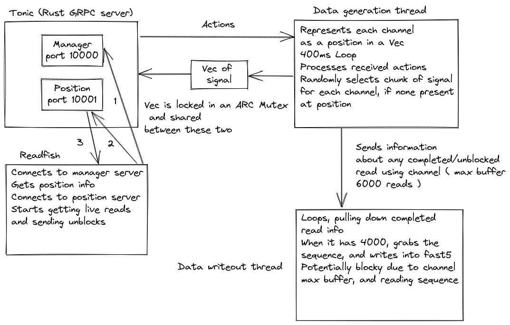

# Icarust
Rust Minknow simulator
---
🦀🚀

Figure 1 - Accurate depiction of a man learning Rust ☠️
### `Warning`
Icarust is a work in progress - but it seems to work

## Quick start

Icarust requires Rust > 1.56. In order to install Rust instructions can be found [here.](https://www.rust-lang.org/tools/install)

In order to run Icarust with the pre set config and squiggle - 

```zsh
git clone https://github.com/Adoni5/Icarust
cd Icarust
cargo run --release
```

## Changing Configured settings
In the base directory a file called config.toml exists. The fields in there are fairly self explanatory, and changing them is refelecetd throughout the whole simulated run.

## Generating squiggle to serve

In the python directory a script called make_squiggle.py exists. I recommend [conda](https://conda.io/projects/conda/en/latest/user-guide/install/linux.html) in order to create the python environment to use this script. 

`NB` - A python package we _currently_ use is scrappie - which depends on a few C libraries. The names of these for debian systems are listed below. 


    libcunit1
    libcunit1-dev
    libhdf5
    libhdf5-dev
    libopenblas-base
    libopenblas-dev

These can be install with `apt-get install`.

Now that you have all the packages required, in the python directory -

```zsh
conda env create -f icarust.yaml
```

To then generate signal to be served, use the provided script, giving any reference files you wish to use as arguments, space seperated. An example -

```zsh
python make_squiggle.py mixed_ref.fa
```
### `Warning` -> If a distributions.json file already exists, this will append to it.

.npy files containing r9.4.1 sequence should now be present in the base directory. These files will have the name of the contig they contain sequence for.

# Ideology

The image above shows the structure of Icarust. The asynchronous main thread is a tokio runtime that handles GRPC requests from readfish. The core rust package that handles this is called Tonic.

### Read fish connecting
There are two servers, a manager and a position server. Readfish first queries the manager sevrer to get the name and port of the position, then it creates a bi-directional streaming RPC request to the position port, sending actions to perform on reads and receiving read chunks.

### Data generation
When Icarust is started, two threads are created, aptly named the Data generation thread and the Data write out thread. These serve as stand in for the actual sequencer part of minKNOW. The data generation thread is a loop with a 400ms pause. This loop first checks for actions that have been sent by the GRPC end point to be handled, namely unblocks. 

It then manipulates a Vec (If from a python background think a List that can only contain one type of elements). This Vec has one element for each channel. The element is a struct, which contains information about the read that the "channel" is currently "sequencing". If there is no signal data stored in the struct, the thread will randomly select a read length from a normal distribution, a contig to pull from using a weighted choice based on contig length, and a random start point. It then reads the signal from a memory map to the signal .npy files, and stores the signal in the Struct. 

This Vec is shared between the Tonic end point and the Data generation thread using a ARC (atomic reference counter) and a mutex for mutual exclusion. This allows either thread to get a lock on the vec whilst it is being read and modfified. 

### Serving reads
When a GetLiveReadsRequest GRPC request comes in, the GRPC server gets a lock on the channels Vec. 
