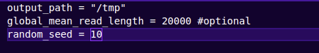
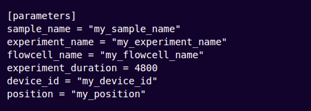
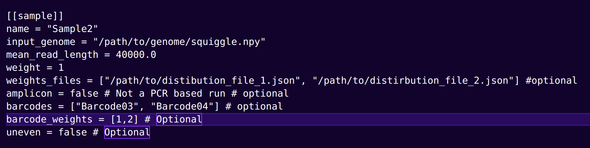
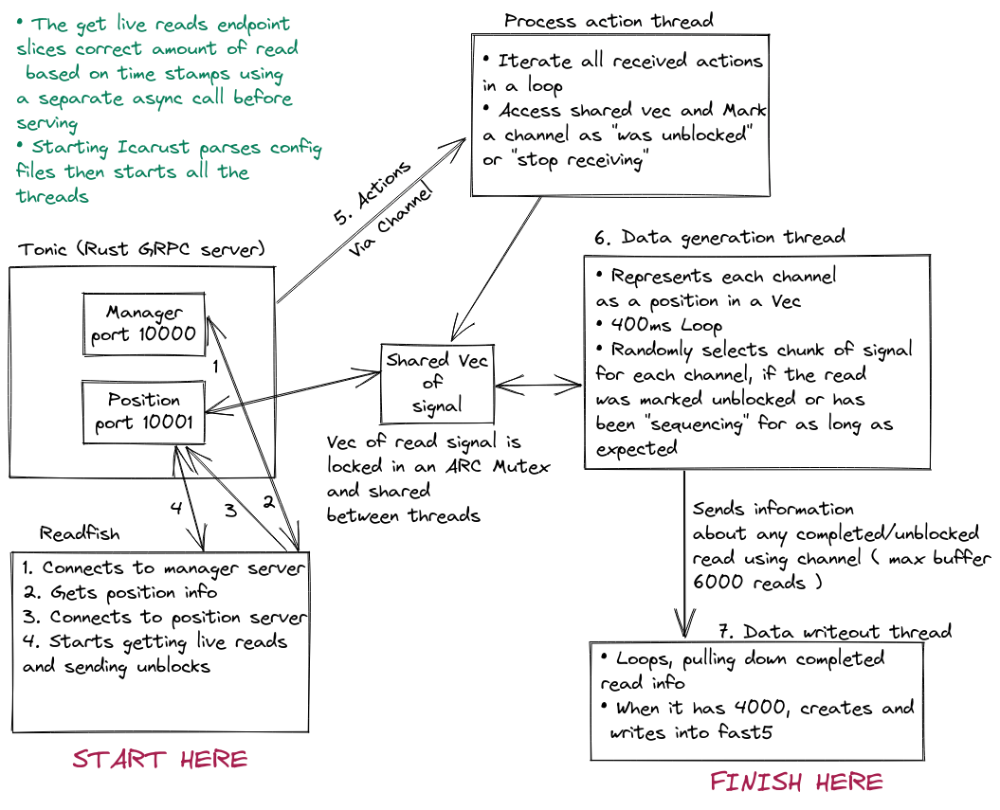

# Icarust
Rust based Minknow simulator
---
🦀🚀

Figure 1 - Accurate depiction of a man learning Rust ☠️
### `Warning`
Icarust is a work in progress - as such some small bugs are to be expected.

## Quick start

Icarust requires Rust > 1.56. In order to install Rust instructions can be found [here.](https://www.rust-lang.org/tools/install)


#### Dependencies

In order to build `tonic` >= 0.8.0, you need the `protoc` Protocol Buffers compiler, along with Protocol Buffers resource files.

#### Ubuntu

```bash
sudo apt update && sudo apt upgrade -y
sudo apt install -y protobuf-compiler libprotobuf-dev
```

#### TLS

Minknow core 5.x requires a secure channel connection be made by the minknow API. IN order to do this it is neccessary to use the localhost certificates provided with an installed version of minknow. Therefore currently _MinKNOW MUST BE INSTALLED_. The certificates are read from /opt/ont/minnow/conf/rpc-certs/.


In order to run Icarust with the pre set config and squiggle - 

```zsh
git clone https://github.com/Adoni5/Icarust
cd Icarust
cargo run --release -- -c Profile_tomls/config.toml -v
```

## Changing Configured settings
<details open>
<summary></summary>
To configure an Icarust simulation a config [TOML](https://toml.io/en/) file is passed to the initialise command. TOML files are minimal and easy to read markup files. Each line is either a key-value pair or a 'table' 
heading.

The config file is split into a global settings, [Parameters](#parameters) and Sample. An example file can be found [here.](examples/example_config.toml)
### Global fields
Global fields are applied more as configuration variables that apply throughout the codebase.


|          Key |       Type      | Required | Description |
|:-------------|:---------------:|:-----------:|:--------:|
| output_path | string | True | The path to a directory that the resulting FAST5 and readfish unblocked_read_ids.txt file will be written to. | 
| global_mean_read_length | int | False | If set, any samples that do not have their own read length field will use this value.| 
| random_seed | int  | False | The seed to use in any Random Number generation. If set this makes exeriments repeatable if the value is retained. | 

### Parameters
The parameters are applied to the "sequencer". They are used to setup the GRPC server so that it is connectable to. They are also written out in the FAST5 files.


|          Key |       Type      | Required | Description |
|:-------------|:---------------:|:-----------:|:--------:|
| sample_name | string | True | The sample name for the simulation | 
| experiment_name | string | True | The experiment name for the simulation| 
| flowcell_name | string  | True | The flowcell name for the simulation | 
| experiment_duration | int  | False | The experiment duration in minutes **CURRENTLY UNUSED** | 
| device_id | string  | True | The device ID - can be anything. | 
| position | string  | True | Position name. This has to match what readfish is looking for. |

### Sample
The sample configures what squiggle will be served. This is provided as an array of tables - i.e it is possible to specify more than one sample field. An Array of tables is sepcified by enclosing the section title in [[]].


|          Key |       Type      | Required | Description |
|:-------------|:---------------:|:-----------:|:--------:|
| name | string | True | The sample name. | 
| input_genome | string | True | Path to **either** the squiggle array or a directory of squiggle arrays. If a directory, all squiggle files will be considered as possible sources of reads for this sample.| 
| mean_read_length | float  | False | The mean read length for the distribution of this sample. | 
| weight | int  | True | The relative weight of this sample against any other sample. | 
| weights_files | array[string]  | False | An array of paths to [distribution.json](#distributions) files, if you wish to specify relative likelihood of drawing a read from a given squiggle file. | 
| amplicon | bool | False | Is the sample from a PCR amplicon based run. Means that read squiggle is always the complete length of a squiggle file. |
| barcodes | array[string] | False | Array of Barcode names. Multiple Barcodes can be provided for one sample |
| barcode_Weights | array[string] | False | The relative distribution of barcodes. If not provided any barcodes will be assigned a random likelihood. If provided must same length as the barcodes array.|
| uneven | bool | False | Uneven likelihood of choosing a squiggle array. **currently unused**|
</details>

## Generating squiggle to serve
<details open>
<summary></summary>
In the python directory a script called make_squiggle.py exists. I recommend [conda](https://conda.io/projects/conda/en/latest/user-guide/install/linux.html) in order to create the python environment to use this script. 

`NB` - A python package we _currently_ use is scrappie - which depends on a few C libraries. The names of these for debian systems are listed below. 


    libcunit1
    libcunit1-dev
    libhdf5
    libhdf5-dev
    libopenblas-base
    libopenblas-dev

These can be install with `apt-get install`.

`sudo apt-get install libcunit1 libcunit1-dev libhdf5 libhdf5-dev libopenblas-base libopenblas-dev`

Now that you have all the packages required, change into the python directory and create the environment -


```zsh
cd python
conda env create -f icarust.yaml
```

To then generate signal to be served, use the provided script, giving any reference files you wish to use as arguments, space seperated. An example -

```zsh
python make_squiggle.py reference_1.fa reference_2.fa --out_dir /path/to/desired/output/squiggle
```

### Splittling the reference into multiple squiggle arrays with a bed file
It is possible to split a reference into multiple squiggle arrays - i.e to simulate a PCR run by providing a bed file. This is only possible using one reference at a time currently.
```zsh
python make_squiggle.py reference_1.fa --bed_file /path/to/regions.bed --out_dir /path/to/desired/output/squiggle
```

### Distributions

### `Warning` -> If a distributions.json file already exists, this will append to it.

.npy files containing r9.4.1 sequence should now be present in the base directory. These files will have the name of the contig they contain sequence for.

</details>

# Ideology
<details open>
<summary>Expand</summary>


The image above shows the structure of Icarust. The asynchronous main thread is a tokio runtime that handles GRPC requests from readfish. The core rust package that handles this is called Tonic. when Icarust is started the threads populate a shared Vec (think list in python or array in javascript) with one ReadInfo per channel. Any actions received are sent to a seperate thread to be processed, with the correct channel for the action marked as per the action type received. Finished reads are sent to a thread to be written out.

### Parsing the config
Upon initialisation Icarust uses toml-rs to deserialise the config toml into Rust structs. These are then passed through to the data servicer, to inform the threads there where to find squiggle, of any barcodes and ratios of barcodes.

### Read fish connecting
There are two servers, a manager and a position server. Readfish first queries the manager sevrer to get the name and port of the position, then it creates a bi-directional streaming RPC request to the position port, sending actions to perform on reads and receiving read chunks as they become available.

### Data generation
When Icarust is started, three threads are created, aptly named the Data generation thread, the Data write out thread and the Process actions thread. These serve as stand in for the actual sequencer and MinKNOW. The data generation thread is a loop with a 400ms pause.

Every 400ms it unlocks a shared Vec(If from a python background think a List that can only contain one type of elements). This Vec has one element for each channel. The element is a struct, which contains information about the read that the "channel" is currently "sequencing". If the read has been marked by the Process actions thread as unblocked, or if the read has been in the channel longer than the period of time required to sequence a real read, the thread will randomly select a read length from a gamma distribution, a contig to pull from using a weighted choice based on contig length, and a random start point. It then reads the signal from a memory map to the signal .npy files, and stores the signal in the Struct. 

Barcode squiggle can be appended to the randomly selected read by specifying desired barcodes in the config TOML. The chance of choosing a barcode within a sample is also specified in the Config TOML.

This Vec is shared between the Tonic end point and the Data generation thread using a ARC (atomic reference counter) and a mutex for mutual exclusion. This allows either thread to get a lock on the vec whilst it is being read and modfified. 

### Serving reads
When a GetLiveReadsRequest GRPC request comes in, any actions specified in that request are sent to the process actions thread.
If this is the first request, a new asynchronous thread is created, which runs in perpetuity. The thread gets a lock on the channels Vec. It loops through each ReadInfo and checks if the channel is marked as Stop receving or was unblocked. If not, the amount of squiggle is worked out based on how much time in milliseconds has passed since that read was last served. If there is enough a new HashMap (Python Dictionary, Javascript Map/Object) is created and the information and squiggle to return is added to this. Once every channel is checked, if there is data to serve, the HashMap is passed via a channel back to the main GRPC server runtime, where it is split up into 24 read chunks. These are then sent via the bi-directional stream back to the client (Presumably readfish).

### Processing actions.
The process actions thread loops infinitely, iterating a receiver, which has any received actions sent to it. If actions are found, the thread unlocks the shared ReadInfo Vec, and marks the channel that corresponds to the action according to teh action type.

### Writing out data.
The data writeout thread is sent any finished reads (reads that were unblocked or have completed sequencing naturally) via the data generation thread, using message passing with channels. This thread iterates the receiver of each channel in a loop, and once 4000 reads have been accrued these are written into a fast5 file, using the VBZ compression plugin provided by ONT. The fields in the Fast5 file are populated using a mixture of the provided config field values and hardcoded values in the code base.

</details>

# Happy Simulating!
